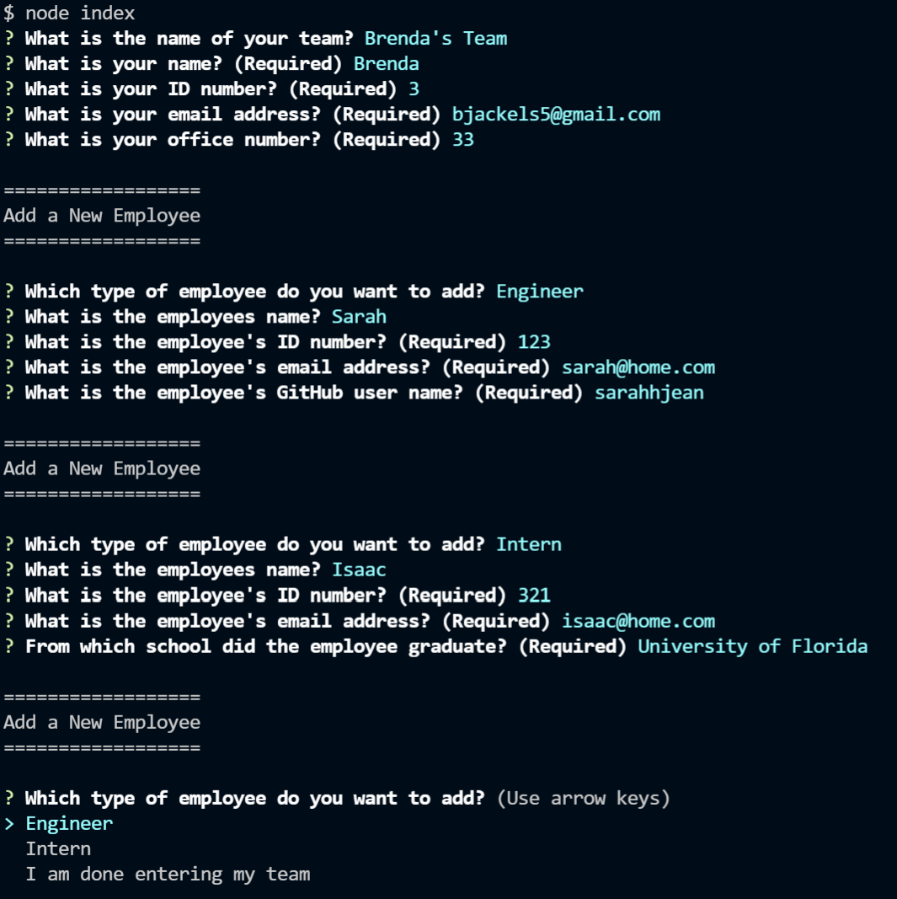

# Team Webpage Generator
This challenge for Module 10 of the Coding Bootcamp is to create a command line interface application that creates a webpage containing contact information for a project team based on user input.

* [Requirements](#requirements)

* [User Story](#userStory)

* [Technologies Used](#techUsed)

* [Credits](#credits)

* [What I Learned](#whatILearned)

* [User Input Screenshot](#webImage)

* [Sample Generated HTML File](#sampleOutputHTML)

* [Sample Generated Screenshot](#sampleOutputScreenshot)

* [Team Webpage Demo](#projectDemo)

* [Contact Me](#contactMe)

---

## Requirements
Build a Node.js command-line application that takes in information about employees on a software engineering team and generates an HTML webpage that displays summaries for each person. 

* Unit tests must be created for each part of the code, and the application must pass all of them.
* The command line interface prompts the user for team members and their information, and then generates an HTML file that displays a nicely formatted team roster
* Clicking on an email address in the HTML will open the default email program and populates the TO field of the email with the 
address.
* Clicking on a GitHub username will open a new tab containing that user's GitHub profile.
* The application will prompt the user to enter the team manager's name, employee ID, email address, and office number.
* After the manager information is entered, the user is presented with a menu with 3 options: add an engineer, add an intern, or to finish building the team
* When the user selections the engineer option, they are prompted to enter the engineer’s name, ID, email, and GitHub username, and then they are taken back to the menu.
* When the user selects the intern option, they are prompted to enter the intern’s name, ID, email, and school, and then they are taken back to the menu.
* When the user selects the option to finish building the team, the HTML is generated and the application exits.

---

## User Story

    AS A manager
    I WANT to generate a webpage that displays my team's basic info
    SO THAT I have quick access to their emails and GitHub profiles

--- 

## Technologies Used

* Jest
* Bootstrap
* Node
* Inquirer
* JavaScript
* HTML
* Built-in file system functionality

--- 

## Credits

Thank you Kim Collazo for the idea of using different colors for the different employee types.

---

## I learned how to...

* Build an entire application using object-oriented programming (OOP), separating data and functionality into different constructor functions.

* Use modern ES6 class syntax to implement inheritance between classes.

* Verify that my code works as intended through automated tests using the Jest framework.
    * mocking data

* Take user input and use template literals to dynamically generate an entire HTML page directly from the command line.

* Integrate constructor functions into  applications, adding structure to  code and reducing the amount of necessary code.

* Build applications using test-driven development, writing tests before implementing functionality (fail/pass/refactor)

* Create more scalable applications that follow the OOP paradigm.

* Use built-in Array prototype functions.

* Use the Inquirer package to control the flow of a game or app.

* Use method inheritance to cut down on code duplication

---

## User Input Screenshot

---

## Sample Generated HTML

<a href="./dist/index.html">Sample Team Webpage HTML</a>

---

## Sample Generated Webpage Screenshot

---
## Team Webpage Generator Demo

---

## Contact Me
You can reach me, Brenda Jackels, at bjackels5@gmail.com.

